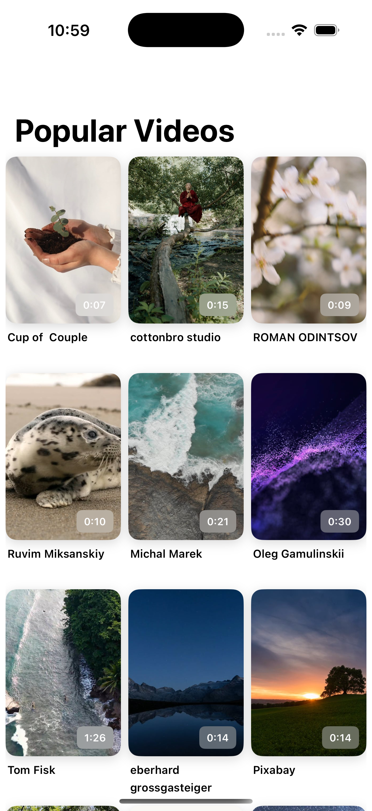
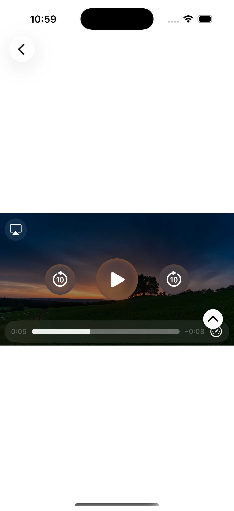
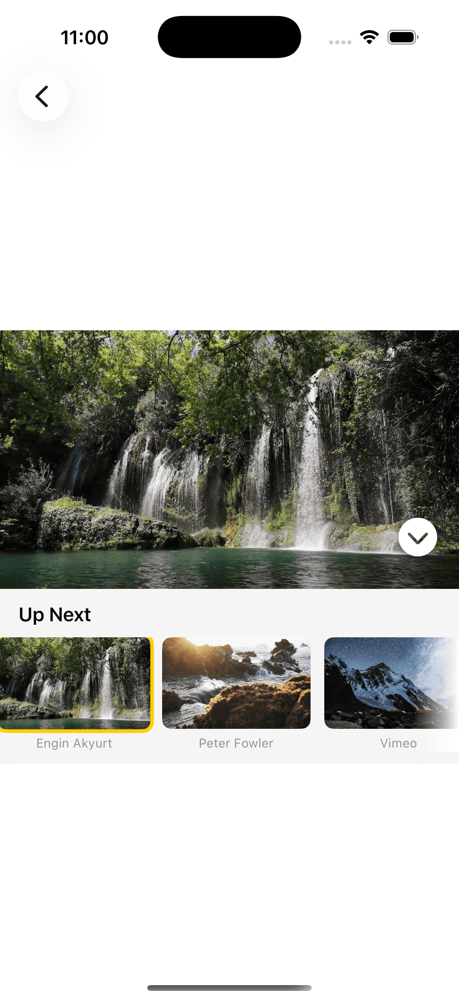

# VideoPlayer

A native iOS application that fetches and plays popular videos from the [Pexels API](https://www.pexels.com/api/). Built with SwiftUI, following MVVM architecture with a clean separation of concerns through the Repository and Coordinator patterns.

## Screenshots

| Video List | Video Player | Up Next |
|:---:|:---:|:---:|
|  |  |  |


### Demo


## Architecture

The project follows **MVVM (Model-View-ViewModel)** as the primary architectural pattern, with additional patterns layered in to keep responsibilities well-defined.

```
VideoPlayer/
├── Models/                  # Data models (Video, VideoResponse)
├── Service/                 # Networking layer (Endpoint, NetworkService)
├── Repository/              # Data access abstraction
├── ViewModels/              # Presentation logic
├── Views/                   # SwiftUI views
├── Coordinators/            # Navigation management
├── Errors/                  # Error types and error UI
├── Helpers/                 # Constants
└── Testing/                 # StubURLProtocol for UI test mocking
```

### Patterns and practices

**Repository Pattern**
`VideosRepository` sits between the ViewModel and the network layer. The ViewModel never talks to `NetworkService` directly — it only depends on `VideosRepositoryProtocol`. This makes the data source easy to swap (for testing, caching, or offline support) without touching any view or ViewModel code.

**Coordinator Pattern**
Navigation is managed through `NavigationCoordinator`, an `ObservableObject` injected via SwiftUI's environment. Views call coordinator methods like `goToPlayVideoPage(videoList:selectedIndex:)` instead of managing `NavigationPath` themselves. This keeps navigation logic out of views and makes the flow easier to reason about.

**Protocol-Oriented Dependency Injection**
Every major component exposes a protocol (`NetworkServiceProtocol`, `VideosRepositoryProtocol`) and accepts its dependencies through initializer injection with sensible defaults. This gives us:
- Compile-time safety for dependency contracts
- Straightforward mocking in tests
- The ability to swap implementations at the composition root

**Composition Root**
Dependency wiring happens at the app entry point — `VideoPlayerApp.init()`. In production builds, the real `VideosRepository` and `NetworkService` are used. In debug builds during UI tests, a `StubURLProtocol` is registered to intercept network requests and return deterministic data. The `#if DEBUG` guard and launch argument check are confined to `VideoPlayerApp.init()` and `StubURLProtocol.swift` — no test-awareness leaks into views or ViewModels.

## Networking

The networking layer is built on `URLSession` and structured around two types:

- **`Endpoint`** — a value type that holds the path, query items, and headers for a request. It constructs a fully qualified `URL` from its components using `URLComponents`.
- **`NetworkService`** — a generic service that takes an `Endpoint`, performs the request, validates the HTTP status code, and decodes the response into any `Decodable` model.

Error handling is explicit: `NetworkService` maps `URLError` codes (e.g. `.notConnectedToInternet`, `.timedOut`) and HTTP status code ranges into a `CustomError` enum, so the UI layer can show appropriate messages without parsing raw errors.

All magic strings and numeric ranges (HTTP status codes, query parameter keys, content type headers) are extracted into `Constants`.

## Pagination

Pagination follows a cursor-based approach. The Pexels API returns a `next_page` URL in each response. Rather than hardcoding page logic, the repository extracts the `page` and `per_page` parameters from that URL using `URLComponents`, keeping the ViewModel unaware of how pagination URLs are structured.

The ViewModel triggers `loadMoreIfNeeded(index:)` when the user scrolls near the end of the list (offset controlled by `Constants.paginationPrefetchOffset`), appending new results to the existing array.

## Screens

### Video List
Displays a grid of video thumbnails fetched from the Pexels API. Each cell shows the thumbnail, videographer name, and duration. Supports infinite scroll through pagination. Shows a shimmer skeleton during the initial load and an error screen with a retry option if the request fails.

### Video Player
Plays the selected video using `AVPlayer`. Includes an "Up Next" panel that shows a horizontally scrollable carousel of remaining videos. Tapping a carousel item switches playback.

## Testing

### Unit Tests (51 tests)

Tests are organized to mirror the source structure and cover the ViewModel, Repository, and Network layers.

| Test Suite | Tests | What it covers |
|---|---|---|
| `VideoListViewModelTests` | 14 | Initial fetch, pagination triggers, error states, loading flags, edge cases (empty response, wrong index) |
| `VideoPlayerViewModelTests` | 14 | Video selection, next/previous navigation, quality preference fallback, toggle state, boundary conditions |
| `VideoRepositoryTests` | 13 | API call delegation, pagination URL parsing, query parameter extraction, nil handling |
| `NetworkServiceTests` | 10 | Request construction, HTTP status validation (2xx, 4xx, 5xx), decoding, URLError mapping, timeout handling |

**Mocking approach:**
Each protocol has a corresponding mock (`MockNetworkService`, `MockVideosRepository`, `MockURLProtocol`) that records whether methods were called and lets tests configure return values or errors. Model types have `.mock()` factory methods with default parameters, so tests only specify the fields they care about.

### UI Tests (7 tests)

UI tests use **launch argument injection** combined with `URLProtocol` stubbing to intercept network requests at the `URLSession` level. The app receives deterministic JSON without hitting the real Pexels API, making assertions reliable and network-independent.

| Test | What it verifies |
|---|---|
| `testVideosListAppearsWithMockData` | Navigation title, scroll view, and videographer names appear from stub data |
| `testDurationBadgesMatchStubData` | Duration badges (0:08, 0:22, 1:07) render correctly from stub durations |
| `testTapVideoNavigatesToPlayer` | Tapping a video tile navigates to the player page |
| `testBackNavigationReturnsToList` | Back button returns to the Popular Videos list |
| `testUpNextToggleRevealsPanel` | Toggle button reveals the "Up Next" carousel |
| `testUpNextToggleCollapsesPanel` | Second toggle tap collapses the panel |
| `testLaunchPerformance` | Measures app launch time |

**How it works:**
1. The UI test sets `app.launchArguments = ["--uitesting"]` before launch.
2. `VideoPlayerApp.init()` detects the flag and registers `StubURLProtocol` via `URLProtocol.registerClass`. This intercepts all `URLSession.shared` requests and returns a hardcoded Pexels API response with 3 videos.
3. Both `StubURLProtocol` and the registration call are wrapped in `#if DEBUG`, so they are compiled out of release builds entirely.
4. Key views have `.accessibilityIdentifier()` modifiers (e.g. `"videosList"`, `"upNextToggle"`, `"upNextPanel"`, `"retryButton"`) for stable element queries.

## Dependencies

| Dependency | Purpose |
|---|---|
| [NukeUI](https://github.com/kean/Nuke) | Async image loading and caching |

## Requirements

- Xcode 16+
- iOS 17.0+

## Getting Started

1. Clone the repository.
2. Open `VideoPlayer.xcodeproj` in Xcode.
3. Build and run on a simulator or device.
4. To run tests: `Cmd + U` in Xcode.
